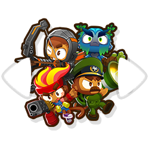

<h1 align="center">In-Game Hero Switch</h1>

### Lets you switch which hero you're using while already in a BTD6 match.

Ever forget to switch your hero before starting up a game?
Now you don't have to exit and and come back.
Just press the **PageUp** / **PageDown** keys (configurable) to cycle through your unlocked heroes.
This will work at any point in a match, so long as your hero isn't already placed down (also configurable).

## NOTE: This alpha version of the mod requires [BTD6 Mod Helper >v3.0](https://github.com/gurrenm3/BTD-Mod-Helper/wiki/Mod-Helper-3.0-Alpha), see [here](https://github.com/doombubbles/BTD6-Mods#readme) for the stable mods

